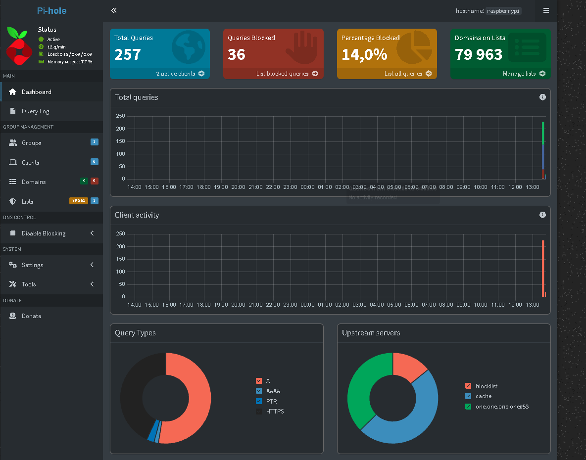

# raspberry-pi-pihole-home-lab
A Raspberry Pi 3 based home network security project using Pi-hole for DNS filtering and network-wide ad and tracker blocking.
# Raspberry Pi Pi-hole Home Lab

A home network security project built with a Raspberry Pi 3 and Pi-hole to provide DNS-level ad and tracker blocking, while learning practical concepts in networking, Linux administration and defensive cybersecurity.

## Project Overview

The objective of this project is to build a small cybersecurity laboratory using a Raspberry Pi 3.

The Raspberry Pi operates as a DNS server using Pi-hole. Network DNS requests are filtered against blocklists before being resolved, allowing unwanted advertising and tracking domains to be blocked at the network level.

The project is also the foundation for a larger home cybersecurity lab that will later include vulnerability scanning, honeypots and automated incident response.

## Architecture

```text
                         Internet
                             │
                             │
                     ┌───────▼───────┐
                     │     Router    │
                     │ 192.168.0.1   │
                     └───────┬───────┘
                             │
                         Ethernet
                             │
                     ┌───────▼───────┐
                     │  Raspberry Pi  │
                     │       3        │
                     │    Pi-hole     │
                     │ 192.168.0.X    │
                     └───────┬───────┘
                             │
                        DNS filtering
                             │
              ┌──────────────┼──────────────┐
              │              │              │
              ▼              ▼              ▼
             PC          Smartphone       IoT
```

## Hardware

* Raspberry Pi 3
* microSD card
* Ethernet connection
* Network router

## Software

* Raspberry Pi OS
* Pi-hole
* DNS
* Cloudflare upstream DNS
* Linux command line tools

## Network Configuration

The Raspberry Pi is connected to the local network through Ethernet.

| Component    | Configuration          |
| ------------ | ---------------------- |
| Router       | `192.168.0.1`          |
| Raspberry Pi | `192.168.0.X`          |
| Interface    | `eth0`                 |
| Connection   | Ethernet               |
| DNS server   | Raspberry Pi / Pi-hole |
| Upstream DNS | Cloudflare             |

The Raspberry Pi's IP address was reserved through the router's DHCP configuration to ensure that the Pi-hole server keeps a consistent address.

## Installation

The Raspberry Pi was first updated using:

```bash
sudo apt update
sudo apt full-upgrade -y
```

Network configuration was verified using:

```bash
hostname -I
```

and:

```bash
ip route
```

The Ethernet interface was identified as:

```text
eth0
```

Pi-hole was then installed and configured as the network DNS server.

The installation was configured to use:

* Ethernet interface: `eth0`
* Upstream DNS provider: Cloudflare
* Privacy mode: Show everything

## DNS Configuration

After installation, a test computer was manually configured to use the Raspberry Pi as its DNS server.

```text
DNS Server:
192.168.0.X
```

This allowed the Pi-hole installation to be tested on a single device before applying the configuration to the entire network.

## Verification

The Pi-hole service was verified using:

```bash
pihole status
```

The Pi-hole FTL service was also checked:

```bash
sudo systemctl status pihole-FTL --no-pager
```

DNS resolution was tested using:

```bash
nslookup google.com
```

The Pi-hole dashboard was then used to verify DNS queries and blocked requests.

## Results

After configuring the test computer to use Pi-hole as its DNS server, DNS queries began appearing in the Pi-hole dashboard.

The Query Log was used to verify:

* DNS requests generated by the client
* Domains being queried
* Allowed DNS requests
* Blocked domains

The system successfully blocked domains included in the configured Pi-hole blocklists.

## Screenshots

### Pi-hole Dashboard



### Query Log


### DNS Test


> Screenshots are included to demonstrate the working state of the project. Sensitive network information should be removed or anonymized before publication.

## Skills Demonstrated

This project provided practical experience with:

* Linux administration
* Raspberry Pi administration
* DNS
* DHCP
* IPv4 networking
* Network interfaces
* DNS filtering
* Network troubleshooting
* Command-line tools
* Basic defensive cybersecurity
* Network monitoring
* Technical documentation

## Challenges

During installation, the Pi-hole installer initially reported an error related to dependency installation.

The issue was addressed by repairing the package state and installing the required `curl` dependency:

```bash
sudo apt update
sudo apt --fix-broken install
sudo apt install curl -y
```

The Pi-hole installation was then successfully completed.

## Future Improvements

This project is intended to become part of a larger home cybersecurity laboratory.

Planned improvements include:

* Automated network vulnerability scanning with Nmap
* Scheduled security reports
* Honeypot deployment
* Centralized log collection
* Threat detection
* Python-based security automation
* Automated incident response
* Firewall-based IP blocking
* Security alerts through messaging platforms

## Project Status

**Status:** Completed — Phase 1

The Raspberry Pi 3 is currently operating as a Pi-hole DNS server and has been successfully tested with a client device.

## Author

**Mika**

Cybersecurity student building a practical home security laboratory using Raspberry Pi, Linux and open-source security tools.
